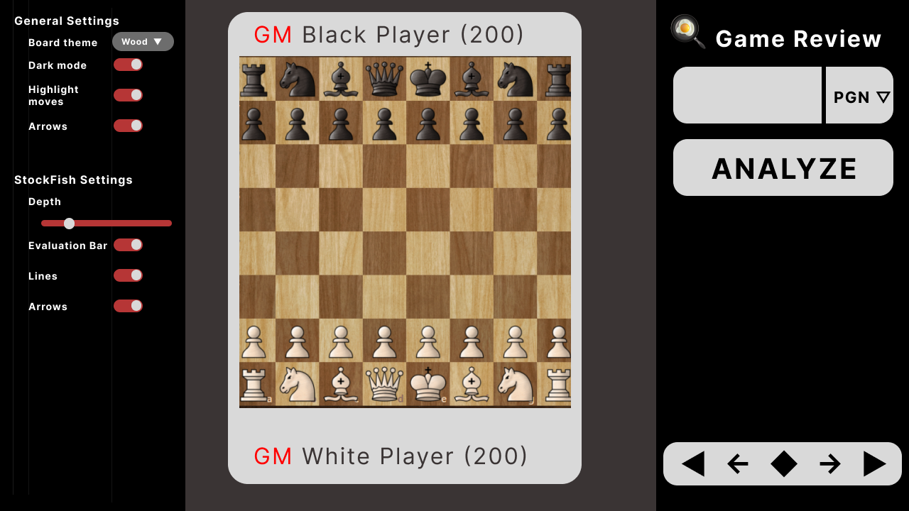
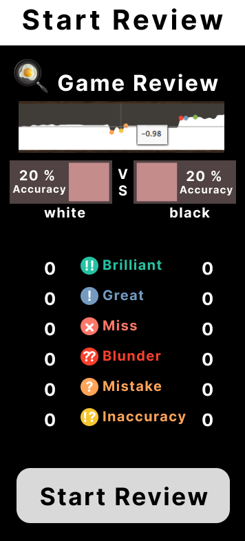
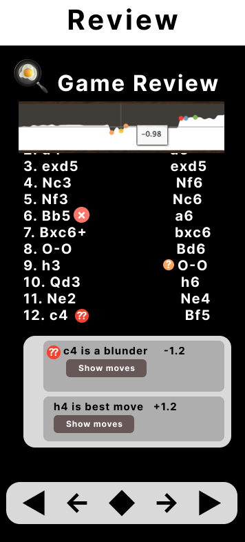

# Chess Game Review App with React js and Tailwind CSS

System similar to Chess.com which gives review of each move.

Inspiration [chess.wintrcat.uk](https://chess.wintrcat.uk/)

## 1. Packages plan to use:

- [Tailwind CSS](https://tailwindcss.com/docs/guides/create-react-app)
- [React Icons](https://react-icons.github.io/react-icons/)
- [Github Pages](https://github.com/gitname/react-gh-pages)
- [Chess.js](https://www.npmjs.com/package/chess.js?activeTab=readme)
- [Chess Board](https://www.npmjs.com/package/cm-chessboard)
- [Stockfish](https://www.npmjs.com/package/stockfish)
- [NextUI](https://nextui.org/docs/guide/installation)

## Basic working of website

User can enter chess.com username or game PGN to analyze with stockfish. Analysis system will be similar to chess.com in which user will get feedback from stockfish, each move will be laballed `blunder`, `great`, or something like that.

This time I will use packages to display chess board and for logic which will make it easier for me. I am using Typescript this time for first time for strict typecheck. I will try to make good and reactive interface with NextUI.

## Steps to Follow

### 1. Setup

- [x] Installing Packages
- [x] Creating Basic UI elements

### 2. API

- [x] Using Chess.com API to get user game
- [ ] Lichess API for opening positions

### 3. BOARD

- [x] Creating Board with Chess Board Package
- [x] Try different pieces
- [ ] choose good colors and themes

### 4. LOGIC

- [x] Reading PGN
- [x] Going forwad and backward through moves
- [ ] Getting moves and evaluation from stockfish
- [ ] Dispalying Evaluation bar and top lines
- [ ] Move review based on change on evaluation
- [ ] Graph to show change in evaluation
- [ ] Calculating Accuracy and Rating of user

## [Chess.com](https://chess.com) Game analysis has following features I will try to implement them:

- Shows accuracy of player and evaluation of each moves
- Gives each move label
  1.  Brillient Move (Sacrifice)
  2.  Great Move (Only winning Move)
  3.  Best Move
  4.  Excellent Move
  5.  Good Move
  6.  Book Move (Theory)
  7.  Inaccuracy (Or humans call it confusing move)
  8.  Miss (Couldn't find winning move)
  9.  Blunder (Loosing game or piece or advantate)
  10. Forcing Move (Only legal move)
- Shows best move and Continuation
- Key moves
- Explains what each move does
- Shows graph which is summary of game as it shows back and forth evaluation of the position
- Also gives analysis board in which we can make move and

## Just completed making Design for this website, it is a bit copy of [chess.com](https://chess.com), [chess.wintrcat](https://chess.wintrcat.uk), and [my previous chess project](https://bibekbhusal0.github.io/Chess).

> The logo infront of Game Review is not Omlet in pan it is Search icon it is the emoji which I founded closest to magnifying glass.

## While Reviewing game this is how right side panal supposed to look

> I don't know how will I make the graph i jsut add screenshot from chess.com

## After clicking After Review button this is how right side panel supposed to look

